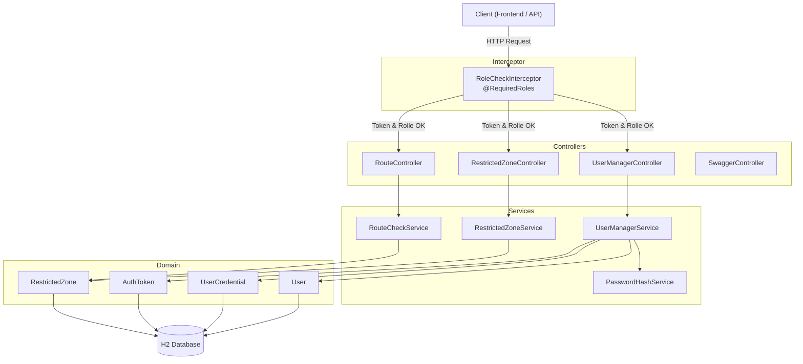

# Backend-Architektur

## Technologie-Stack

Grails 6 (Groovy / Spring Boot), H2-Datenbank, JTS für Geometrie-Operationen.

## Schichtendiagramm

## Auth-Konzept

Kein Spring Security — die Authentifizierung läuft über einen eigenen `AuthToken` (UUID). Der `RoleCheckInterceptor` prüft vor jedem Request den Bearer-Token und wertet die `@RequiredRoles`-Annotation auf der jeweiligen Controller-Methode aus.

## OpenAPI

Die `openapi.yaml` liegt einmalig im Projekt-Root und wird von Gradle beim Build automatisch in den Grails-Classpath kopiert. Sie ist über `/openapi.yaml` (YAML) und `/swagger-ui` (UI) erreichbar.
