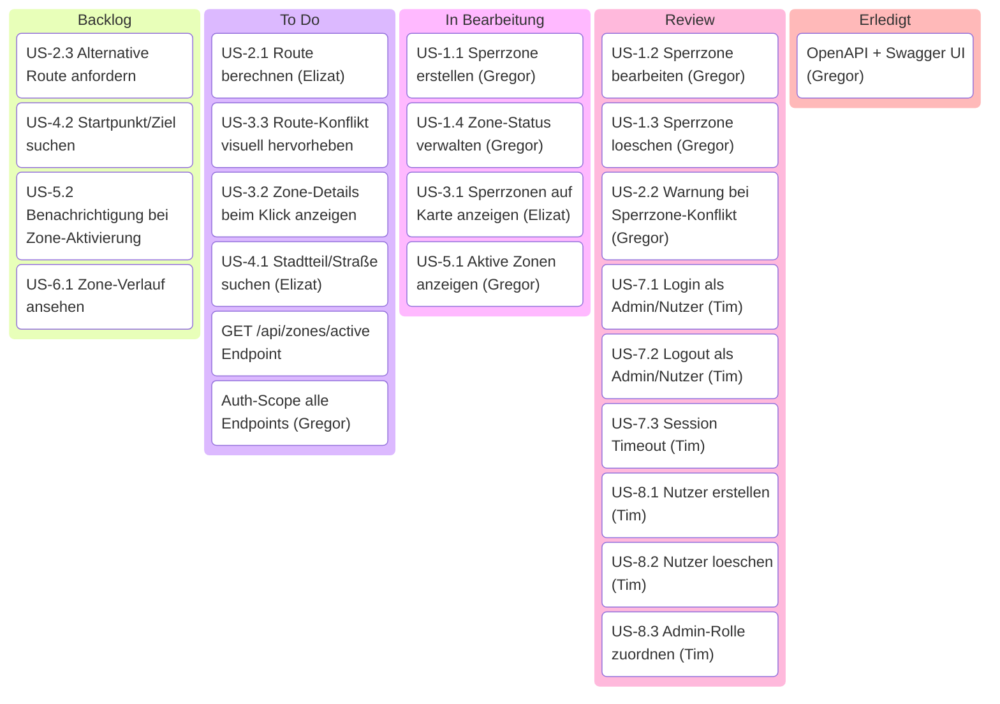

# Kanban-Board — Urban Flow Governance

Arbeitsboard auf Basis der User Stories aus [USER_STORIES.md](USER_STORIES.md) und [USER_STORIES.csv](USER_STORIES.csv).

## Zuständigkeiten

- **Elizat Mairambek kyzy** — Frontend: Einarbeitung in Technologien, Planung und Umsetzung
- **Gregor Kobilarov** — Backend: Zonenverwaltung, Routenprüfung, OpenAPI; Frontend-Unterstützung
- **Tim Lanzendoerfer** — Backend: Authentifizierung, User Management; Datenbankanbindung

## Board

> Erfordert Mermaid ≥ 11.4 (VS Code Mermaid Preview Extension o.ä.).

## Kommentare

| ID | Kommentar |
|----|-----------|
| US-2.1 | Prototyp in `.devcontainer/frontend/`; Grails-Integration ausstehend |
| US-4.1 | Geocoding via Nominatim im Prototyp vorhanden; Grails-Integration ausstehend |
| US-1.1 | Backend/API + Tests fertig (save, PLANNED-Status); Polygon-Zeichnen + Admin-UI offen |
| US-1.4 | Status-Enum + activate/deactivate fertig; zeitgesteuerte Übergänge + UI fehlen |
| US-3.1 | Prototyp mit Leaflet + Mock-Daten; API-Anbindung + Grails-Integration ausstehend |
| US-5.1 | Service.listActive vorhanden und getestet; REST-Endpoint + Sidebar/Panel fehlen |
| GET /api/zones/active | Service.listActive() vorhanden, Controller-Action fehlt noch |
| Auth-Scope | Alle Endpoints erhalten @RequiredRoles. GET /api/zones, GET /api/zones/{id}, GET /api/zones/active, POST /api/route/check → ADMIN + NUTZER; schreibende Zone-Endpoints + User-Management → ADMIN |
| US-1.2 | update-Endpoint + Integrationstest grün; Frontend-Integration ausstehend |
| US-1.3 | delete-Endpoint + Integrationstest grün; Bestätigungsdialog im Frontend offen |
| US-2.2 | RouteCheckService liefert OK/WARNING mit Zone + Zeitraum; UI-Darstellung offen |
| US-7.1–7.3 | Ready für Review. Frontend-Integration ausstehend |
| US-8.1–8.3 | Ready für Review. Frontend-Integration ausstehend |

## Hinweise

- Eintraege koennen im Format `US-x.y Titel | Bearbeiter: Name | Kommentare: Kurznotiz` gepflegt werden.
- Bearbeiter bleibt leer bzw. `offen`, bis eine Aufgabe zugewiesen ist.
- Kommentare dienen fuer kurze Rueckfragen, Abhaengigkeiten oder Statushinweise.
