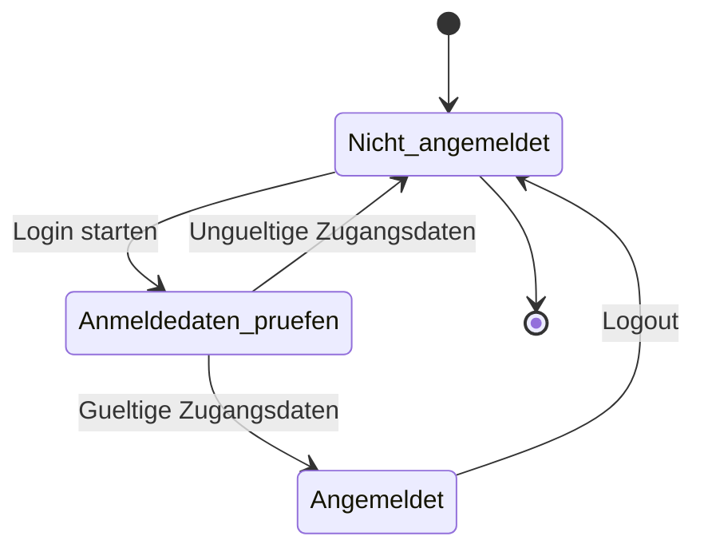
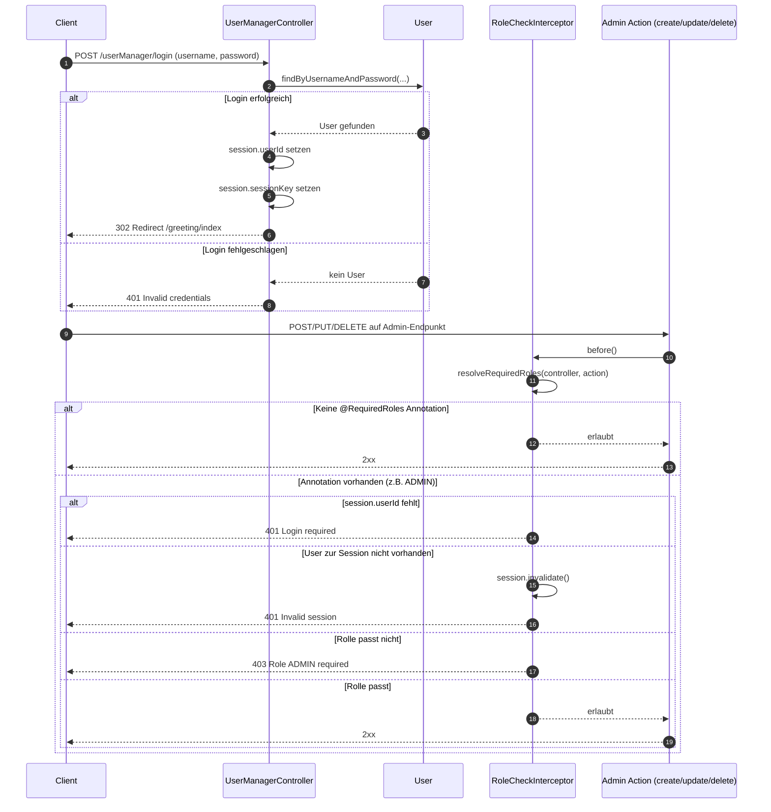

# Login/Logout Zustandsdiagramm



## Sequenzdiagramm: Login und Admin-geschuetzter Request



## API-Skizze (OpenAPI-Style)

Hinweis: Dies ist eine kompakte, dokumentierende Spezifikation basierend auf der aktuellen Implementierung.

```yaml
openapi: 3.0.3
info:
	title: Urban Flow Governance - User Management API
	version: 1.0.0
	description: Login/Logout und Admin-Nutzerverwaltung
servers:
	- url: /
paths:
	/userManager/login:
		post:
			summary: Benutzer anmelden
			requestBody:
				required: true
				content:
					application/x-www-form-urlencoded:
						schema:
							type: object
							required: [username, password]
							properties:
								username:
									type: string
								password:
									type: string
			responses:
				'302':
					description: Login erfolgreich, Redirect auf /greeting/index
				'400':
					description: username oder password fehlt
				'401':
					description: Invalid credentials

	/userManager/logout:
		post:
			summary: Benutzer abmelden
			responses:
				'302':
					description: Logout erfolgreich, Redirect auf /greeting/index

	/userManager/create:
		post:
			summary: Nutzer erstellen (nur ADMIN)
			description: Benoetigt eingeloggten Benutzer mit Rolle ADMIN.
			requestBody:
				required: true
				content:
					application/x-www-form-urlencoded:
						schema:
							type: object
							required: [username, password]
							properties:
								username:
									type: string
								password:
									type: string
								role:
									type: string
									default: NUTZER
									enum: [ADMIN, NUTZER]
			responses:
				'201':
					description: User created
				'400':
					description: Validierungsfehler
				'401':
					description: Login required oder Invalid session
				'403':
					description: Role ADMIN required

	/userManager/update:
		put:
			summary: Nutzer aktualisieren (nur ADMIN)
			description: Benoetigt Query-Parameter id.
			parameters:
				- in: query
					name: id
					required: true
					schema:
						type: integer
						format: int64
			requestBody:
				required: false
				content:
					application/x-www-form-urlencoded:
						schema:
							type: object
							properties:
								username:
									type: string
								password:
									type: string
								role:
									type: string
									enum: [ADMIN, NUTZER]
			responses:
				'200':
					description: User updated
				'404':
					description: User not found
				'400':
					description: Validierungsfehler
				'401':
					description: Login required oder Invalid session
				'403':
					description: Role ADMIN required

	/userManager/delete:
		delete:
			summary: Nutzer loeschen (nur ADMIN)
			description: Benoetigt Query-Parameter id.
			parameters:
				- in: query
					name: id
					required: true
					schema:
						type: integer
						format: int64
			responses:
				'200':
					description: User deleted
				'404':
					description: User not found
				'401':
					description: Login required oder Invalid session
				'403':
					description: Role ADMIN required

components:
	securitySchemes:
		sessionCookie:
			type: apiKey
			in: cookie
			name: JSESSIONID
```
