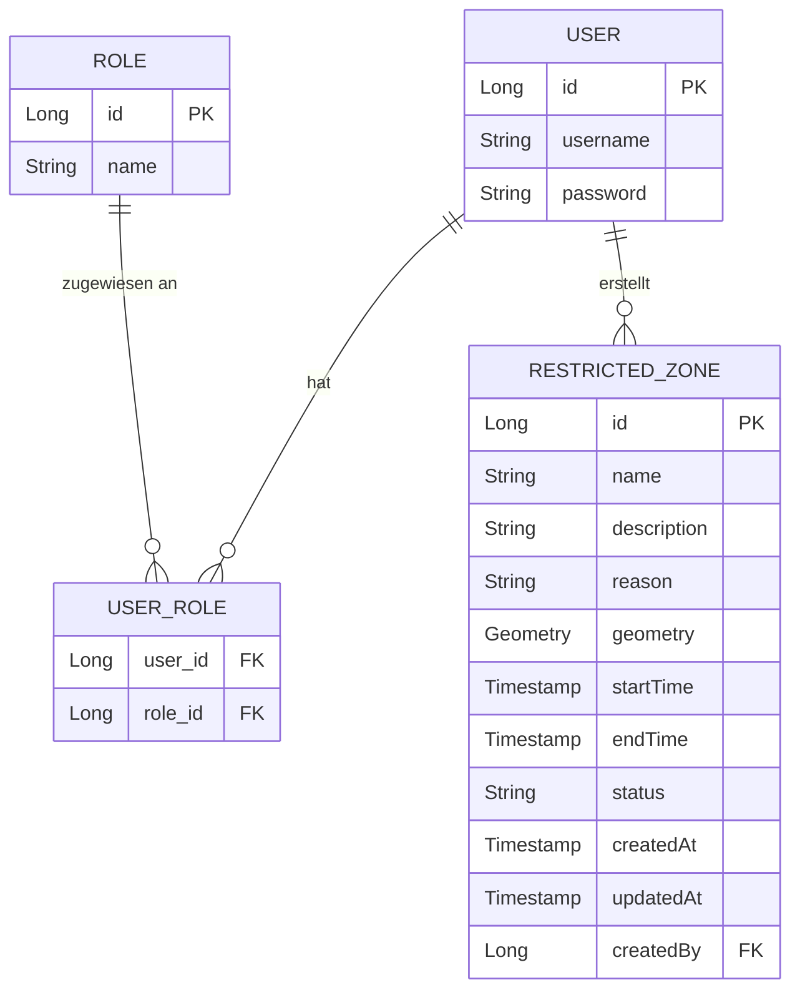
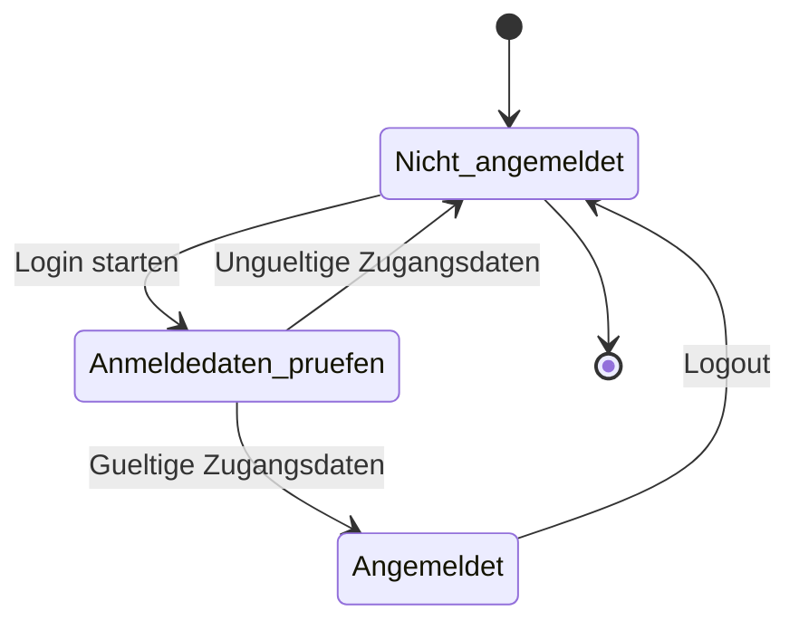
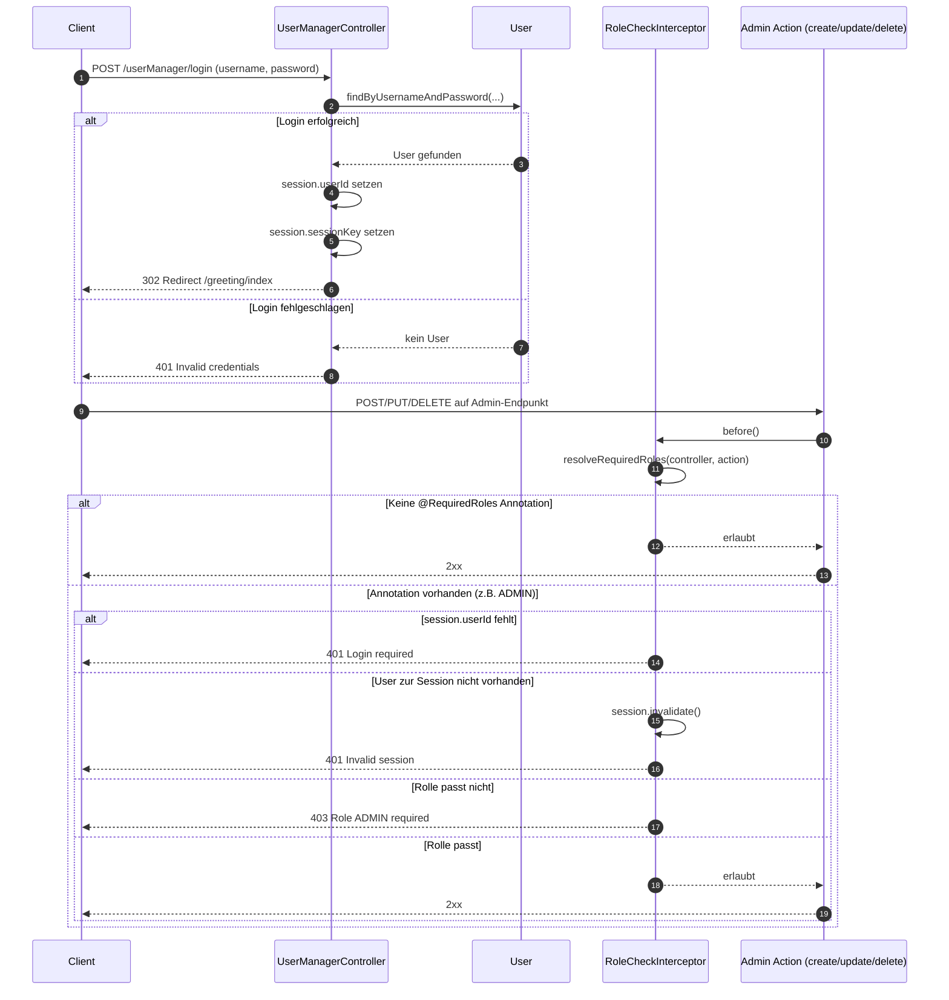
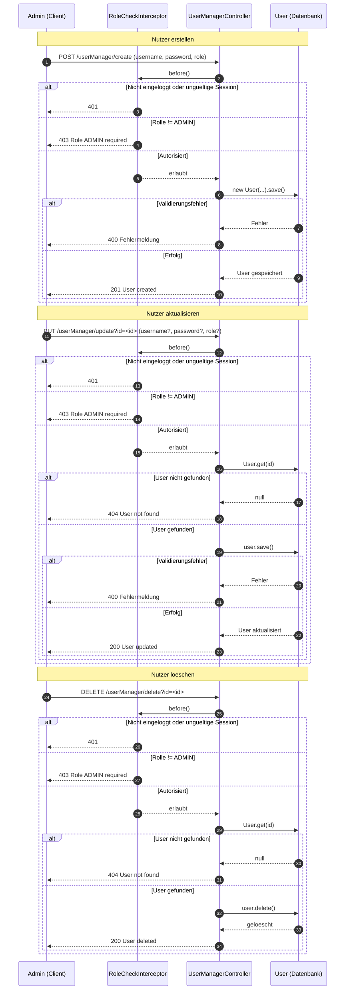
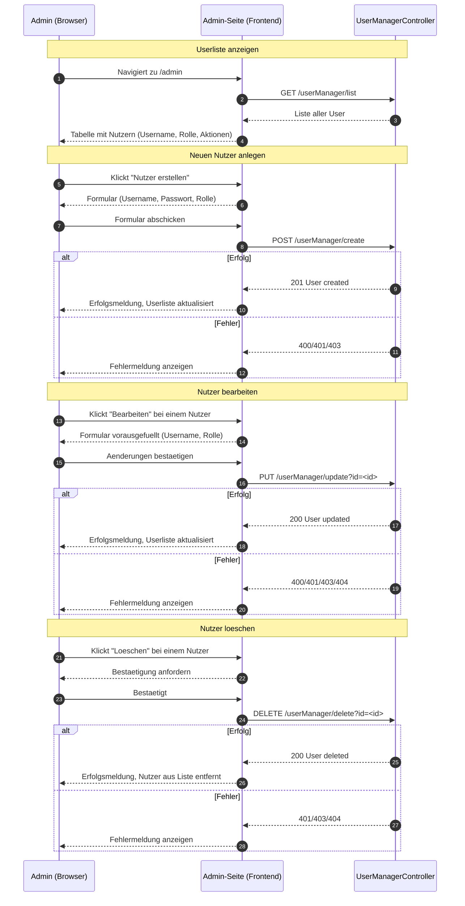

# Entity-Relationship-Diagramm: Datenbankstruktur

> Hinweis: `ROLE.name` entspricht den bisherigen Werten `NUTZER` und `ADMIN`, ist aber erweiterbar (z.B. `MODERATOR`, `AUDITOR`).
> `RESTRICTED_ZONE.status` kann `PLANNED`, `ACTIVE` oder `EXPIRED` sein. `geometry` wird als PostGIS-Polygon (`GEOMETRY(Polygon, 4326)`) gespeichert.

# Login/Logout Zustandsdiagramm

## Sequenzdiagramm: Login und Admin-geschuetzter Request

## API-Skizze (OpenAPI-Style)

<!-- include: USER_MANAGEMENT.openapi.yaml -->

Die vollständige Spezifikation liegt ausgelagert in [USER_MANAGEMENT.openapi.yaml](USER_MANAGEMENT.openapi.yaml). Wenn dein Doku-Renderer Includes unterstützt, kann diese Datei hier direkt eingebunden werden; ansonsten bleibt sie als separate, versionierte Quelle erhalten.

## Sequenzdiagramm: Admin User-CRUD

## Sequenzdiagramm: Admin-UI Seitenablaeufe

