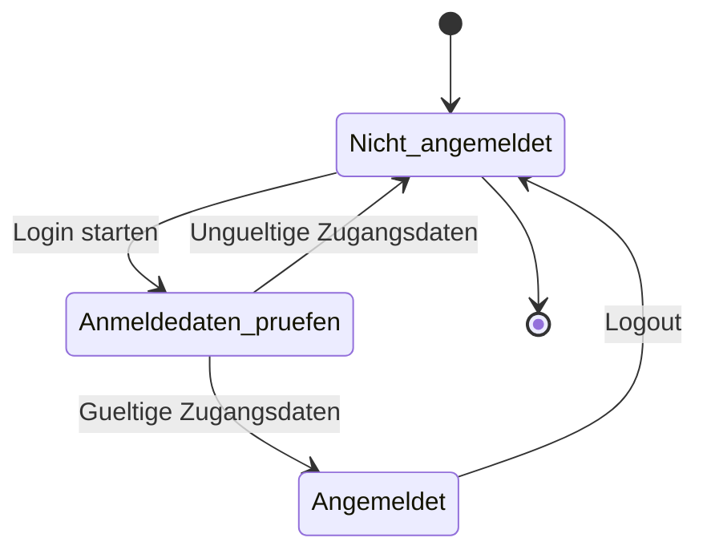

# Login/Logout Zustandsdiagramm

```mermaid
stateDiagram-v2
	[*] --> Nicht_angemeldet

	Nicht_angemeldet --> Anmeldedaten_pruefen: Login starten
	Anmeldedaten_pruefen --> Angemeldet: Gueltige Zugangsdaten
	Anmeldedaten_pruefen --> Nicht_angemeldet: Ungueltige Zugangsdaten

	Angemeldet --> Nicht_angemeldet: Logout
	Nicht_angemeldet --> [*]
```
