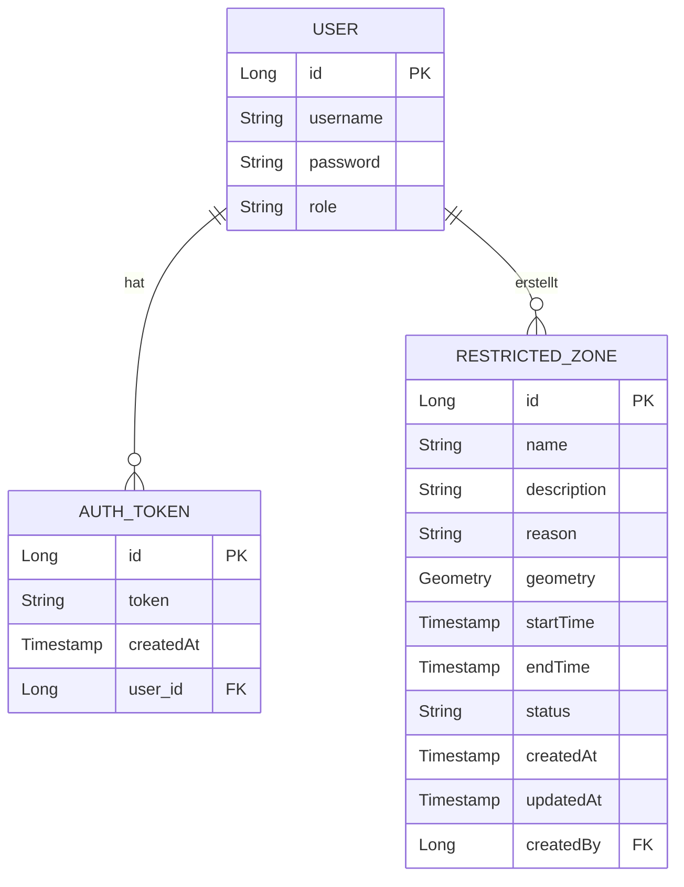
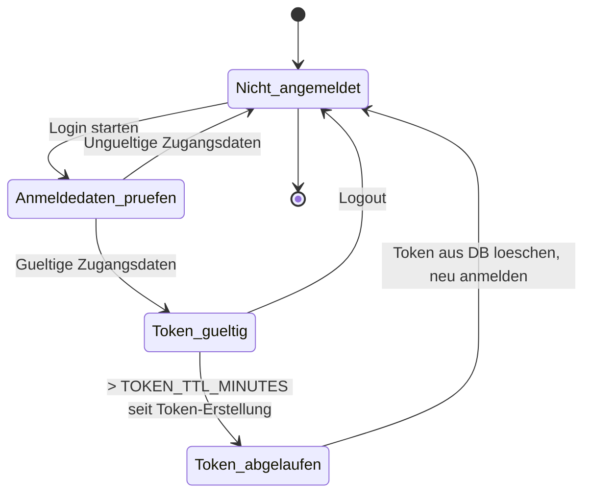
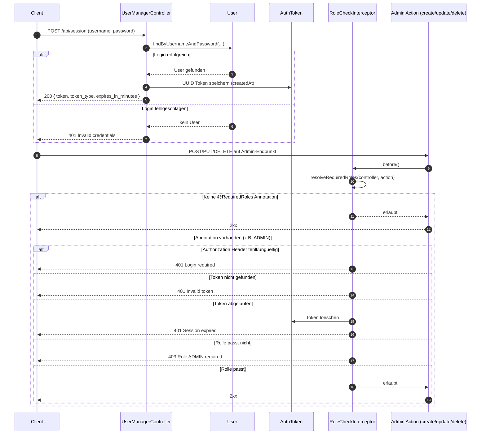
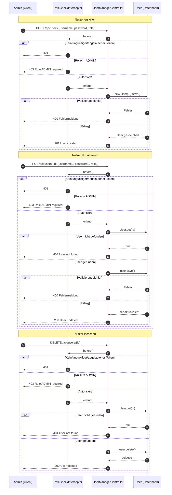
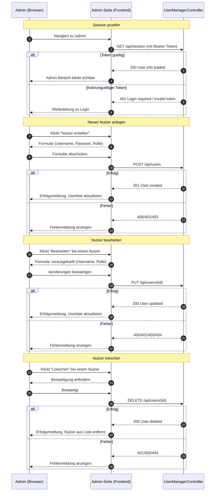

# Entity-Relationship-Diagramm: Datenbankstruktur



> Hinweis: `USER.role` verwendet aktuell die Werte `NUTZER` und `ADMIN`.
> `RESTRICTED_ZONE.status` kann `PLANNED`, `ACTIVE` oder `EXPIRED` sein. `geometry` wird als PostGIS-Polygon (`GEOMETRY(Polygon, 4326)`) gespeichert.

# Login/Logout Zustandsdiagramm



## Sequenzdiagramm: Login und Admin-geschuetzter Request



## API-Skizze (OpenAPI-Style)

<!-- include: USER_MANAGEMENT.openapi.yaml -->

Die vollständige Spezifikation liegt ausgelagert in [USER_MANAGEMENT.openapi.yaml](USER_MANAGEMENT.openapi.yaml). Wenn dein Doku-Renderer Includes unterstützt, kann diese Datei hier direkt eingebunden werden; ansonsten bleibt sie als separate, versionierte Quelle erhalten.

## Curl-Beispiele

```bash
# 1) Login und Token erhalten
curl -s -X POST "http://localhost:8080/api/session" \
	-d "username=admin&password=adminpass"

# 2) Session-Userinfo mit Bearer-Token abrufen
curl -X GET "http://localhost:8080/api/session" \
	-H "Authorization: Bearer <TOKEN>"

# 3) Logout mit Bearer-Token
curl -X DELETE "http://localhost:8080/api/session" \
	-H "Authorization: Bearer <TOKEN>"

# 4) User erstellen (ADMIN)
curl -X POST "http://localhost:8080/api/users" \
	-H "Authorization: Bearer <TOKEN>" \
	-d "username=max&password=secret&role=NUTZER"

# 5) User aktualisieren (ADMIN)
curl -X PUT "http://localhost:8080/api/users/1" \
	-H "Authorization: Bearer <TOKEN>" \
	-d "username=max2&role=ADMIN"

# 6) User loeschen (ADMIN)
curl -X DELETE "http://localhost:8080/api/users/1" \
	-H "Authorization: Bearer <TOKEN>"
```

## Sequenzdiagramm: Admin User-CRUD



## Sequenzdiagramm: Admin-UI Seitenablaeufe


