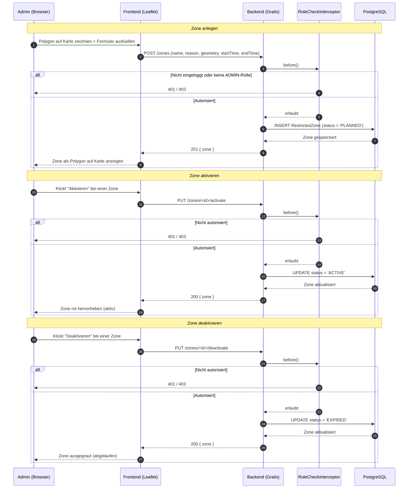

# Zone Management

## Sequenzdiagramm: Route-Check

```mermaid
sequenceDiagram
    autonumber
    participant U as Nutzer (Browser)
    participant FE as Frontend (Leaflet)
    participant BE as Backend (Grails)
    participant OSRM as OSRM Service
    participant DB as PostgreSQL (PostGIS)

    U->>FE: Start und Ziel eingeben
    FE->>BE: GET /route?from=<start>&to=<ziel>
    BE->>OSRM: GET /route/v1/driving/<start>;<ziel>
    OSRM-->>BE: Route als Koordinatenliste

    BE->>DB: SELECT aktive Sperrzonen (status = 'ACTIVE')
    DB-->>BE: Liste aktiver Zonen

    loop Jeder Routenpunkt
        BE->>BE: ST_Contains(zone.geometry, punkt)?
        alt Kollision erkannt
            BE->>BE: alert = true, betroffene Zone merken
        end
    end

    alt Keine Kollision
        BE-->>FE: 200 { route, status: "OK" }
        FE-->>U: Route gruen anzeigen
    else Kollision
        BE-->>FE: 200 { route, status: "WARNING", zones: [...] }
        FE-->>U: Route rot markieren, Warnung anzeigen
    end
```

## Sequenzdiagramm: Zone verwalten


