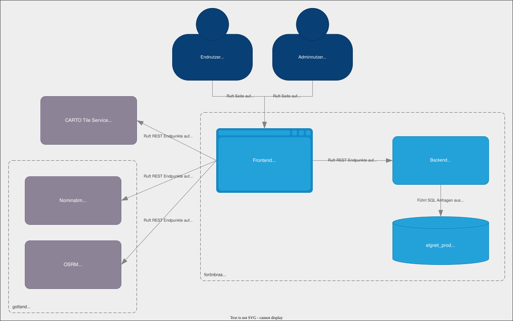

# Architecture

## Einordnung

- Das Frontend laedt die API ueber `window.API_BASE` und spricht damit den Backend-Container an.
- Das Frontend nutzt Nominatim fuer Geocoding sowie OSRM fuer Routing.
- Die Karte verwendet CARTO als Tile-Quelle; Leaflet ist dabei die Client-Bibliothek und deshalb kein eigener Container.
- Das Backend persistiert seine Daten in PostgreSQL mit PostGIS fuer Geometrien und Zonenoperationen.

## Quellen im Projekt

- [README.md](README.md)
- [frontend/config.js](frontend/config.js)
- [frontend/app.js](frontend/app.js)
- [openapi.yaml](openapi.yaml)
- [Backend-Architektur](docs/architecture/BACKEND_ARCHITECTURE.md)
