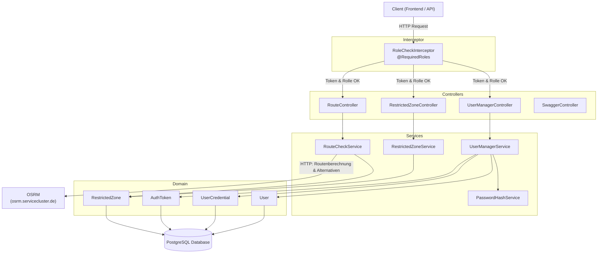
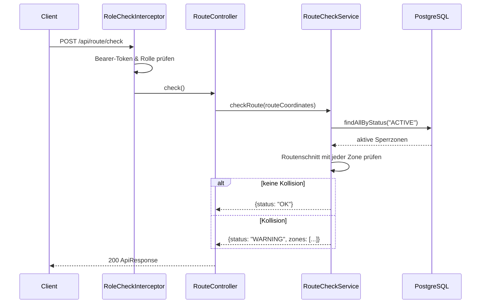
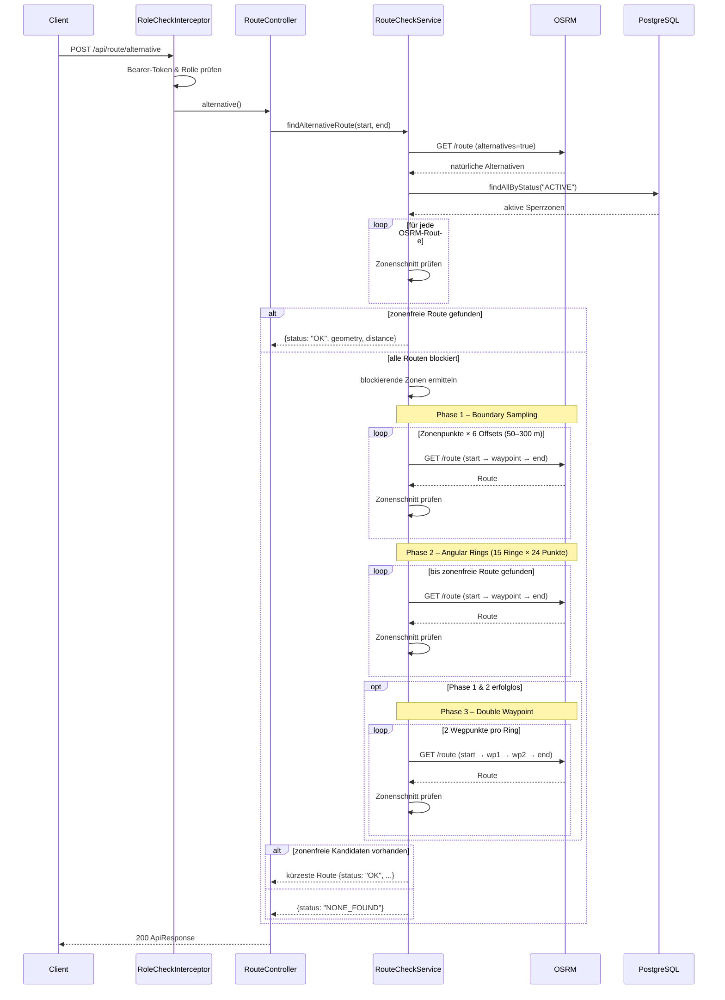

# Backend-Architektur

## Technologie-Stack

Grails 6 (Groovy / Spring Boot), PostgreSQL-Datenbank, JTS für Geometrie-Operationen.

## Schichtendiagramm



## Sequenzdiagramme

### Route Check (`POST /api/route/check`)



### Alternative Route (`POST /api/route/alternative`)



## Auth-Konzept

Kein Spring Security — die Authentifizierung läuft über einen eigenen `AuthToken` (UUID). Der `RoleCheckInterceptor` prüft vor jedem Request den Bearer-Token und wertet die `@RequiredRoles`-Annotation auf der jeweiligen Controller-Methode aus.

## OpenAPI

Die `openapi.yaml` liegt einmalig im Projekt-Root und wird von Gradle beim Build automatisch in den Grails-Classpath kopiert. Sie ist über `/openapi.yaml` (YAML) und `/swagger-ui` (UI) erreichbar.

## Datenbank-Konfiguration

### Umgebungsabhängige Datenbanken

Die Datenbank-Einstellungen sind in [grails-app/conf/application.yml](../../ufg-app/grails-app/conf/application.yml) definiert:

| Umgebung | Typ | Host/URL | Datenbank | Benutzer | Bemerkung |
|----------|-----|----------|-----------|----------|-----------|
| **Development** | PostgreSQL | localhost:5432 | `elgreti` | `elgreti` | Schema wird mit `dbCreate: create-drop` verwaltet |
| **Test** | H2 (In-Memory) | - | `testDb` | `sa` | Isolierte Test-DB, wird für Integration Tests verwendet |
| **Production** | PostgreSQL | localhost:5432 | `elgreti_prod` | `iu` | `dbCreate: none`, Connection-Pool mit 5-50 aktiven Verbindungen |

### Zugriff auf die Datenbank im Dev-Container

**PostgreSQL (Production):**  
phpPgAdmin UI: https://iu.servicecluster.de/phppgadmin/

```bash
# Auf Prod-Server auf die DB zugreifen
psql -h localhost -U iu -d elgreti_prod
```

**PostgreSQL (Development):**

```bash
# Im Dev-Container auf die Entwicklungs-DB zugreifen
psql -h localhost -U elgreti -d elgreti
```

**Häufig verwendete psql-Befehle:**

```sql
-- Tabellen auflisten
\dt

-- Schema anzeigen
\d tablename

-- Datenbank-Größe
SELECT pg_database.datname,
       pg_size_pretty(pg_database_size(pg_database.datname)) AS size
FROM pg_database;

-- Alle Verbindungen anzeigen
SELECT datname, count(*) FROM pg_stat_activity GROUP BY datname;
```

**H2-Datenbank (Test):**

Die Test-Datenbank läuft in-memory während der Testausführung. Um die H2-Konsole lokal zu aktivieren, kann in `application.yml` (test-Umgebung) folgendes hinzugefügt werden:

```yaml
h2:
  console:
    enabled: true
```

Dann ist sie unter `http://localhost:8080/h2-console` erreichbar (JDBC URL: `jdbc:h2:mem:testDb`).
