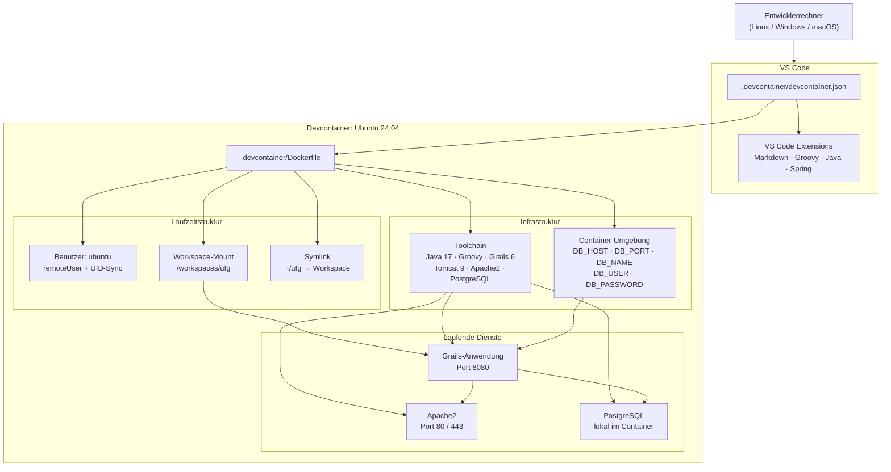

# Devcontainer-Architektur

## Zweck

Der Devcontainer stellt eine reproduzierbare Entwicklungsumgebung für Urban Flow Governance bereit. Er bündelt Betriebssystem, Laufzeitumgebung, Datenbankzugang und VS-Code-Erweiterungen in einem klar definierten Setup.

## Kernaussage für die Folie

Ein Container, ein Workspace, eine konsistente Toolchain: Die Entwicklung läuft in einer Ubuntu-24.04-Umgebung mit Java 17, Groovy, Grails, Tomcat und PostgreSQL direkt im Container.

## Strukturübersicht

## Bausteine

### 1. Basis-Image und Pakete

- Ubuntu 24.04 als Container-Basis
- Vorinstalliert sind unter anderem `bash`, `curl`, `git`, `sudo`, `apache2`, `postgresql`, `zip` und `unzip`
- Der Container legt einen lokalen PostgreSQL-Startzustand an

### 2. Laufzeitwerkzeuge

- Java 17 als Standard-Java
- Groovy als Sprachlaufzeit
- Grails 6.2.3 als Framework
- Tomcat 9 als Zielumgebung für den späteren Betrieb

### 3. VS-Code-Integration

- Der Workspace wird direkt in VS Code im Container geöffnet
- Markdown-Mermaid ist installiert, damit Diagramme in der Doku gerendert werden können
- Java-, Groovy- und Spring-Tooling sind für die tägliche Entwicklung verfügbar

### 4. Datenbank und Umgebungsvariablen

- PostgreSQL läuft im Container und wird beim Start vorbereitet
- Die Anwendung erhält DB-Zugangsdaten über Container-Umgebungsvariablen
- Der Fokus liegt auf einer lokalen, reproduzierbaren Entwicklungsdatenbank

### 5. Ports und Erreichbarkeit

- Port 8080 für Grails/Tomcat
- Port 80 und 443 für Apache2
- Die Ports werden automatisch an VS Code weitergereicht

## Startablauf

1. VS Code öffnet das Repository im Devcontainer
2. `devcontainer.json` baut das Image über das Dockerfile
3. Der Container startet als User `ubuntu`
4. Ein Symlink auf den Workspace wird erstellt
5. Java, Groovy und Grails werden geprüft
6. PostgreSQL wird gestartet und ist direkt nutzbar

## Folienhinweis

Für eine Präsentationsfolie eignet sich die Grafik oben zusammen mit drei Kernaussagen:

- Reproduzierbare Entwicklungsumgebung auf Ubuntu 24.04
- Vollständige Toolchain im Container statt lokaler Einzelinstallation
- Gleiche Basis für Entwicklung, Debugging und spätere Auslieferung
