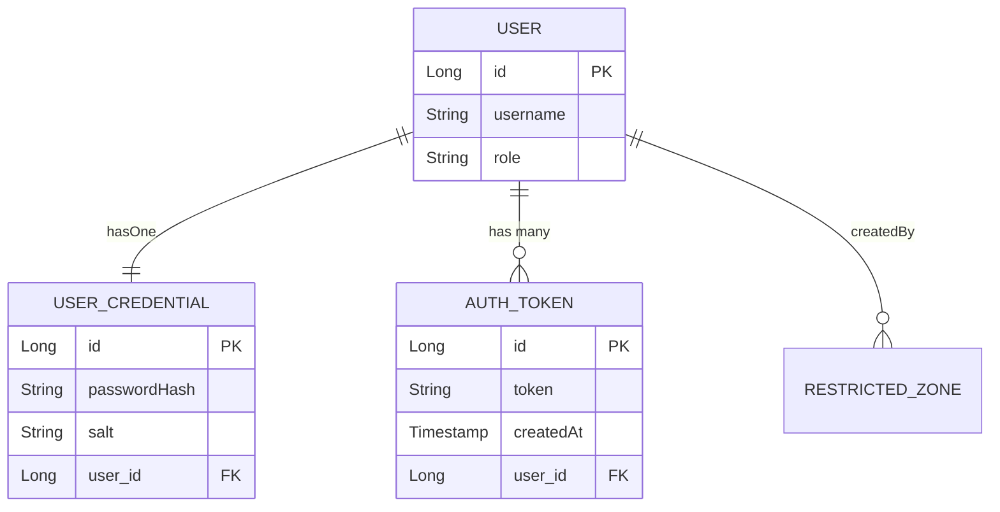
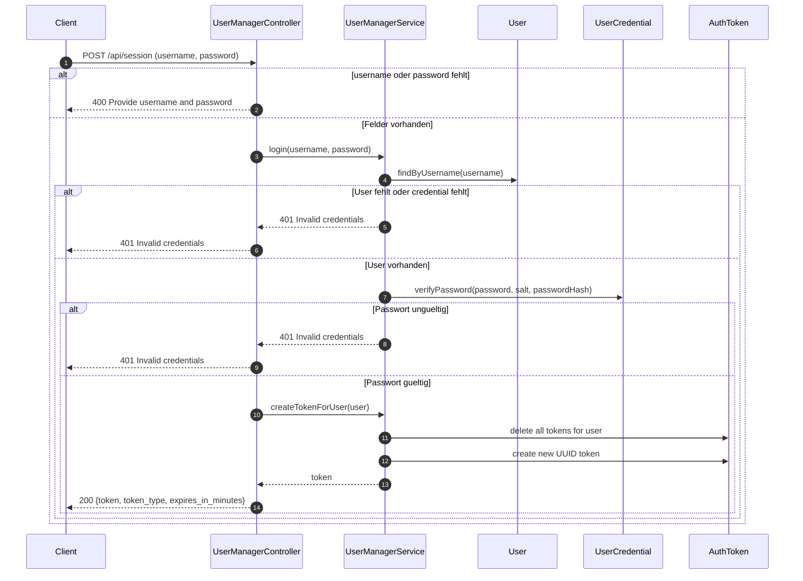
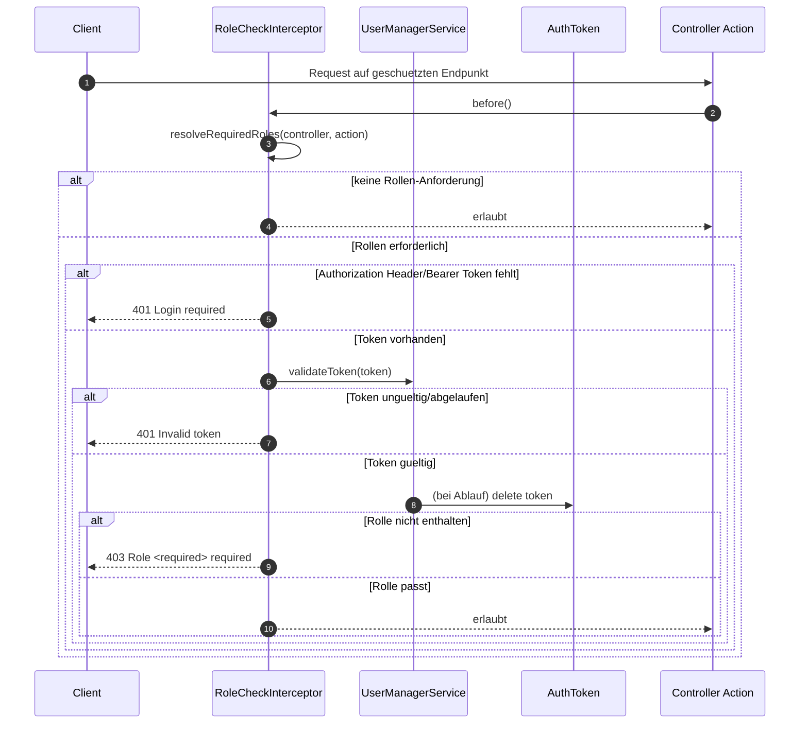
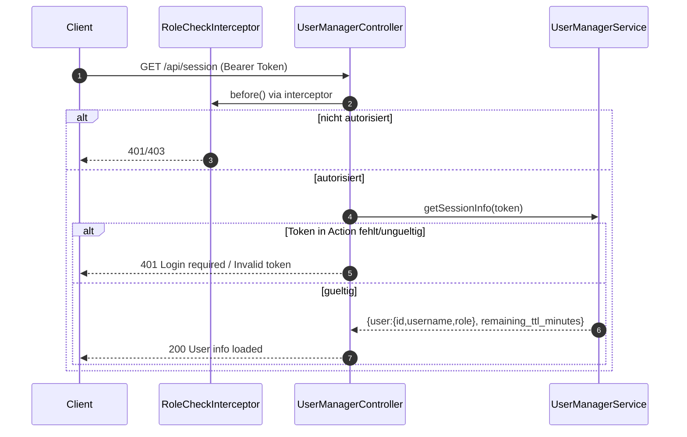
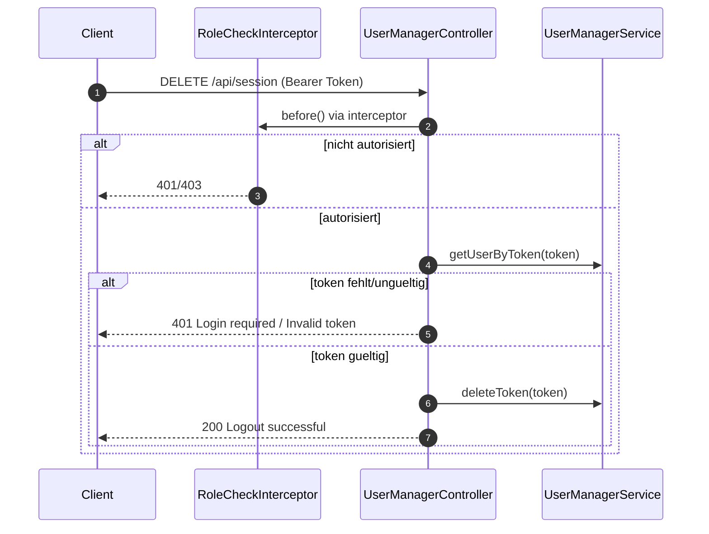
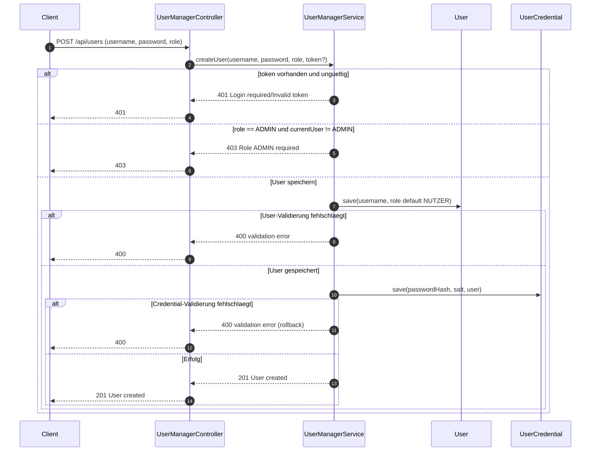
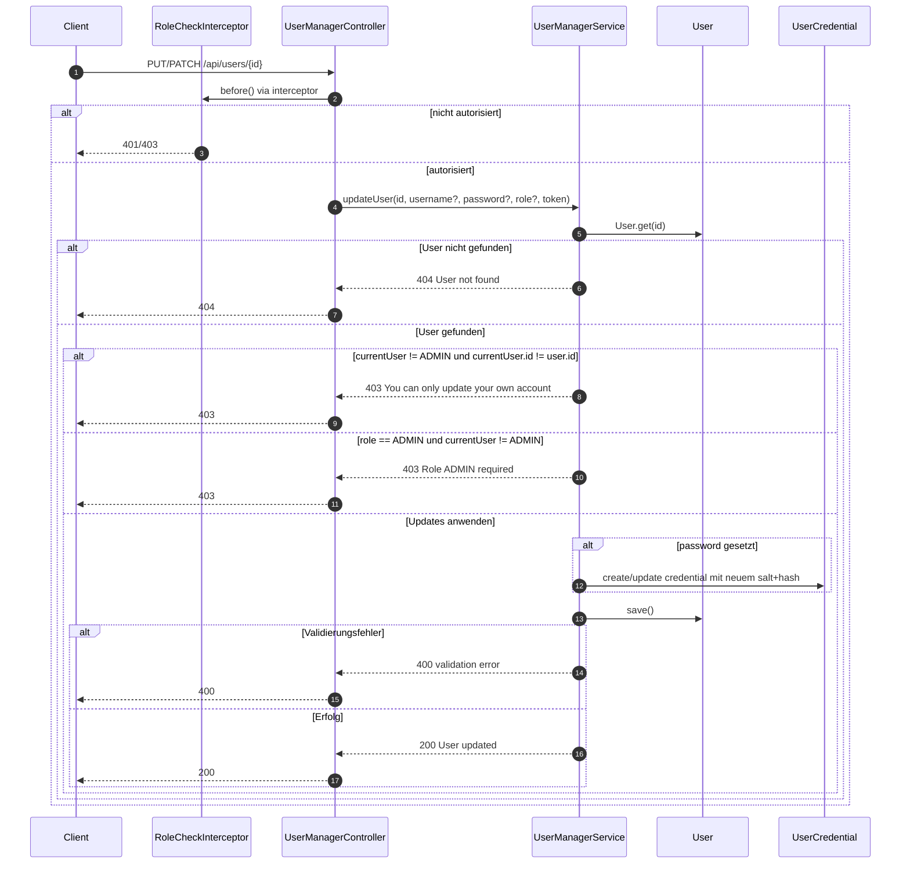
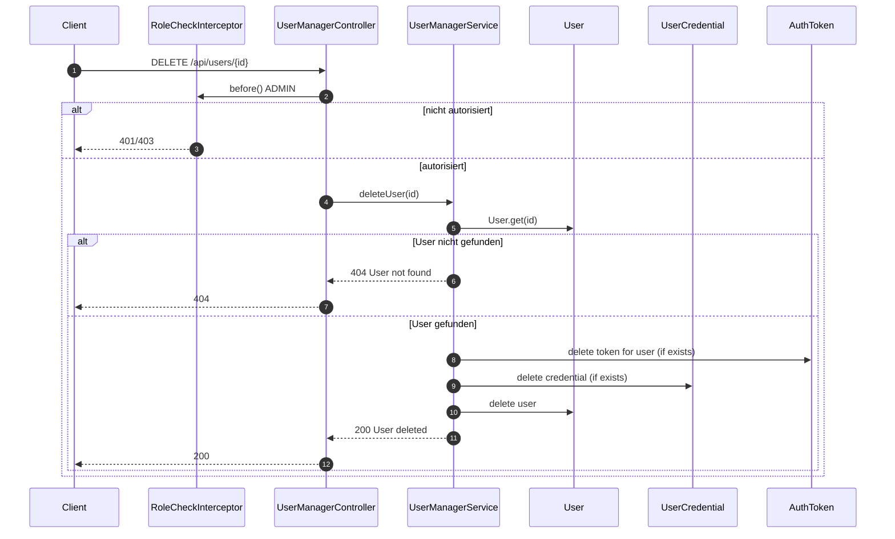
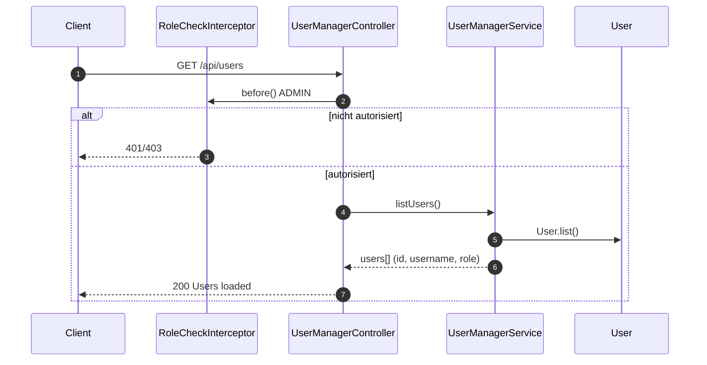

# User Management und Authentifizierung

Diese Doku beschreibt den aktuellen Stand der Implementierung in:
- `UserManagerController`
- `UserManagerService`
- `RoleCheckInterceptor`
- Domain-Klassen `User`, `UserCredential`, `AuthToken`

## Datenmodell (Ist-Stand)

Wichtige Punkte:
- Passwoerter liegen nicht in `USER`, sondern als `passwordHash` + `salt` in `USER_CREDENTIAL`.
- `username` ist eindeutig; `UserCredential.user` ist 1:1 (unique); `AuthToken.token` ist eindeutig.
- Rollen sind aktuell: `NUTZER`, `ADMIN`.
- `TOKEN_TTL_MINUTES` kommt aus Environment (`TOKEN_TTL_MINUTES`), Default: `60`.
- Bei neuem Login werden alte Tokens des Users geloescht (Single-Session-Verhalten).

## Endpunkte und Autorisierung

Hinweis zu `POST /api/users`:
- Ohne Token kann ein `NUTZER` erstellt werden.
- `ADMIN` kann nur erstellt werden, wenn ein gueltiger Token eines `ADMIN` mitgesendet wird.

## Token-Validierung

Token werden zentral ueber `UserManagerService.validateToken()` geprueft:
- fehlt Token -> `Login required`
- Token nicht gefunden/ungueltig/abgelaufen -> `Invalid token`
- Token ohne User-Referenz -> Token wird geloescht und als ungueltig behandelt

Ablaufdatum:
- `minutesSince(createdAt) > TOKEN_TTL_MINUTES` => Token wird geloescht.

## Sequenzdiagramm: POST /api/session (username, password)

## Sequenzdiagramm: Auth-Guard fuer geschuetzte Endpunkte

Gilt fuer Actions mit `@RequiredRoles`.

## Sequenzdiagramm: GET /api/session

## Sequenzdiagramm: DELETE /api/session

## Sequenzdiagramm: POST /api/users

## Sequenzdiagramm: PUT/PATCH /api/users/{id}

## Sequenzdiagramm: DELETE /api/users/{id}

## Sequenzdiagramm: GET /api/users

## Offene Besonderheiten (bewusst dokumentiert)

- `POST /api/users` ist nicht per Annotation geschuetzt, die Rollenregel fuer ADMIN-Erstellung sitzt im Service.
- `PUT/PATCH /api/users/{id}` erlaubt auch `NUTZER`, aber nur fuer das eigene Konto.
- Bei abgelaufenem Token ist die Fehlermeldung aktuell `Invalid token` (nicht `Session expired`).
- Service-Hilfsmethode `success(...)` fuegt `extra` auf Top-Level hinzu; dadurch liegt `users` aktuell nicht unter `data`, sondern direkt im Ergebnisobjekt.
