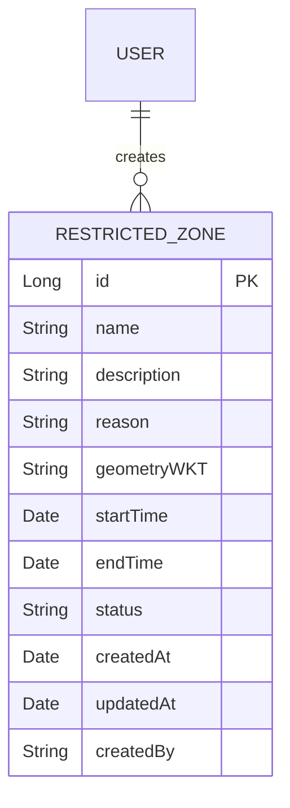
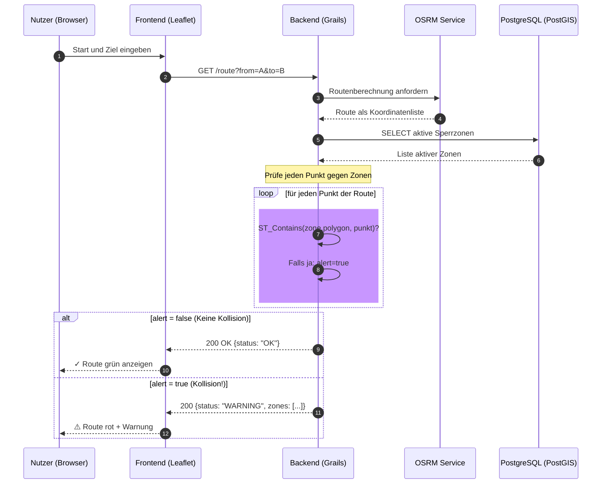
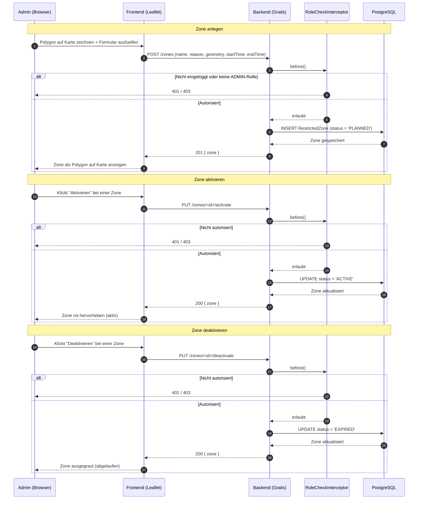

# Zone Management

## Datenmodell

**Wichtige Punkte:**
- `geometryWKT` speichert die Polygon-Geometrie als WKT-String (Well-Known Text Format)
- `status` kann einen der Werte haben: `PLANNED`, `ACTIVE`, `EXPIRED`
- `reason` ist einer von: `Marathon`, `Baustelle`, `Umweltalarm`
- `createdBy` speichert den Username des Benutzers, der die Zone angelegt hat
- `startTime` und `endTime` definieren den Gültigkeitszeitraum der Zone

## Sequenzdiagramm: Route-Check

## Sequenzdiagramm: Zone verwalten

