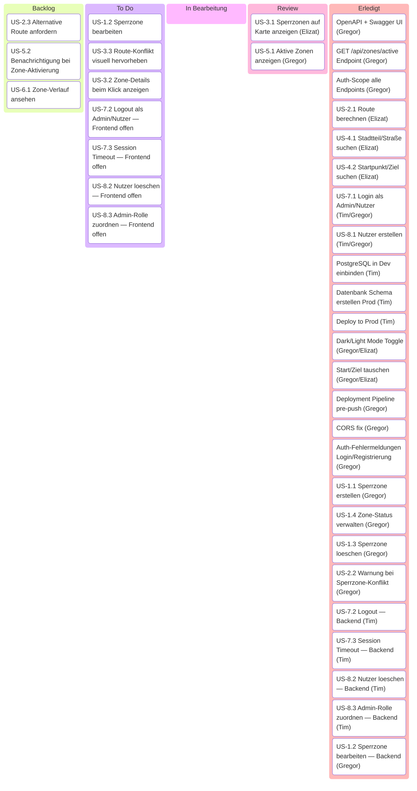

# Kanban-Board — Urban Flow Governance

Arbeitsboard auf Basis der User Stories aus [USER_STORIES.md](USER_STORIES.md) und [USER_STORIES.csv](USER_STORIES.csv).

## Zuständigkeiten

- **Elizat Mairambek kyzy** — Frontend, Karte, Geocoding, Routing
- **Gregor Kobilarov** — Backend, GIS, API, Frontend
- **Tim Lanzendoerfer** — Backend, Auth, User Management, Infrastruktur, Datenbank

## Board

> Erfordert Mermaid ≥ 11.4 (VS Code Mermaid Preview Extension o.ä.).

## Kommentare

| ID | Kommentar |
|----|-----------|
| US-2.1 | Route-Berechnung via OSRM fertig; Auto-Trigger bei Eingabe beider Felder |
| US-4.1 | Autocomplete via Nominatim fertig |
| US-4.2 | Start-/Zielmarker auf Karte fertig |
| US-1.1 | Backend/API + Tests fertig; Polygon-Zeichnen + Admin-UI fertig |
| US-1.4 | Status-Enum + activate/deactivate + ZoneTransitionService (60s-Scheduler) fertig; Aktivieren/Deaktivieren-Buttons im Admin-Panel fertig |
| US-3.1 | API-Anbindung fertig; Zonen laden via API und farbkodiert in Prod; dedizierter Review-Schritt mit Elizat offen |
| US-5.1 | Zonen werden farbkodiert via API in Prod angezeigt (blau/rot/grau); dediziertes Sidebar-Panel mit Name, Grund, verbleibender Zeit fehlt noch |
| Auth-Scope | Alle Endpoints erhalten @RequiredRoles. GET /api/zones, GET /api/zones/{id}, GET /api/zones/active, POST /api/route/check → ADMIN + NUTZER; schreibende Zone-Endpoints + User-Management → ADMIN |
| US-1.2 | Backend fertig (update-Endpoint + Integrationstest grün); Frontend-Integration ausstehend |
| US-1.3 | delete-Endpoint + Integrationstest grün; Bestätigungsdialog + Frontend-Integration fertig |
| US-2.2 | RouteCheckService liefert OK/WARNING mit Zone + Zeitraum; UI-Darstellung fertig (Alert + rote Route) |
| US-7.1 | Login-Frontend fertig und in Prod; Fehlermeldungen für falschen Benutzernamen und falsches Passwort; Bearer-Token in localStorage |
| US-7.2 | Backend fertig; Logout-Button im Frontend fehlt noch |
| US-7.3 | Backend fertig (TOKEN_TTL_MINUTES); kein Frontend-Feedback bei abgelaufener Session |
| US-8.1 | Registrierungs-Frontend fertig und in Prod; Auto-Login nach Registrierung; Fehlermeldung bei vergebenem Benutzernamen |
| US-8.2 | delete-Endpoint + Integrationstest grün; Frontend-Integration ausstehend |
| US-8.3 | update-Endpoint unterstützt Rollenvergabe; Frontend-Integration ausstehend |
| Dark/Light Mode | Toggle in Sidebar; Präferenz in localStorage gespeichert; Leaflet-Tiles per CSS-Filter invertiert |
| Start/Ziel tauschen | Swap-Button zwischen Start/Ziel per getBoundingClientRect() zentriert; tauscht Werte, Koordinaten und Marker |
| Deployment Pipeline | pre-push Hook deployt frontend/ via SCP auf Apache automatisch bei Push auf main |
| CORS fix | Grails-natives CORS aktiviert (application.yml); HttpServletResponseWrapper-Filter in Application.groovy entfernt ACAO-Header aus Tomcat-Antwort, damit Apache genau einen setzt; OPTIONS-Preflight im RoleCheckInterceptor abgefangen |
| Auth-Fehlermeldungen | Login: „Benutzername nicht gefunden" / „Falsches Passwort"; Registrierung: „Benutzername bereits vergeben" |

## Hinweise

- Eintraege koennen im Format `US-x.y Titel | Bearbeiter: Name | Kommentare: Kurznotiz` gepflegt werden.
- Bearbeiter bleibt leer bzw. `offen`, bis eine Aufgabe zugewiesen ist.
- Kommentare dienen fuer kurze Rueckfragen, Abhaengigkeiten oder Statushinweise.
